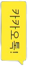

# 기초웹개발론 스페이스 슈터 게임 🚀

<br/>

## 🌈 소개
기존 스페이스 슈터 게임에서 히어로와 몬스터의 이미지를 SNS로 바꾸어 재미있게 만들어보았습니다! 히어로는 레이저로 '카카오톡 메시지'를 날리며, 적(몬스터)는 인스타, 구굴, 페이스북, 네이버가 우주선에 탑승한 이미지로 제작하여 변경했습니다! 소셜 미디어 기업 간 경쟁을 주제로 가볍게 만든 게임이니 단순히 재미있게 즐겨주시면 좋겠습니다!

<br/>
<br/>

## 🔔 추가한 기능 ☀️
- **1. 적(몬스터)의 위치**: 몬스터는 원래 정렬되어 나왔지만, 플레이어에게 긴장감을 주기 위해 화면의 랜덤한 위치에서 나타나게 수정했습니다. 다시 시도를 할 때마다 몬스터의 위치는 바뀝니다. 그리고 몬스터가 화면 아래쪽에 도달하거나 히어로와 충돌하면 히어로는 생명을 잃게 됩니다.
```
// 몬스터 랜덤 생성 
function createMonsters() {
	const MONSTER_TOTAL = 10; // 몬스터의 총 개수
	for (let i = 0; i < MONSTER_TOTAL; i++) {
		let x = Math.random() * canvas.width; // 랜덤 x 포지션
		let y = Math.random() * canvas.height / 2; // 랜덤 y 포지션 + 캔버스 크기의 절반 중 상단에 타나남
		let m = new Monster(x, y);
		m.img = monsterImgs[Math.floor(Math.random() * monsterImgs.length)];
		gameObjects.push(m);
	}
}
```

<br/>
<br/>

- **2. 적(몬스터)의 이미지 추가**: 원래 몬스터의 이미지는 우주선 하나지만, enemyShip말고도 3개의 몬스터 이미지를 추가했습니다. 몬스터의 이미지를 여러 개로 추가하기 위해 각 이미지를 로드하고 몬스터를 생성할 때 랜덤하게 이미지를 선택하도록 코드를 수정했습니다.


```
let monsterImgs;

window.onload = async () => {
    monsterImgs = await Promise.all([
		loadTexture('spaceArt/png/enemyShip.png'),
		loadTexture('spaceArt/png/enemyShip2.png'),
		loadTexture('spaceArt/png/enemyShip3.png'),
		loadTexture('spaceArt/png/enemyShip4.png'),
	]);
};

function createMonsters() {
	const MONSTER_TOTAL = 10; 
	for (let i = 0; i < MONSTER_TOTAL; i++) {
		let x = Math.random() * canvas.width; 
		let y = Math.random() * canvas.height / 2;
		let m = new Monster(x, y);
		m.img = monsterImgs[Math.floor(Math.random() * monsterImgs.length)]; // 몬스터 이미지 랜덤 선택
		gameObjects.push(m);
	}
}
```

<br/>
<br/>

- **3. 파워업 아이템**: 게임 중에 랜덤하게 파워업 아이템이 나타납니다. 히어로가 파워업 아이템을 먹으면 스페이스를 누르지 않아도 자동으로 2번 10초동안 레이저가 발사됩니다.
```
// 파워업 아이템 랜덤 생성
if (Math.random() < 0.1) { // 10% 확률로 파워업 아이템 생성
    let p = new PowerUp(Math.random() * canvas.width, Math.random() * canvas.height);
    p.img = powerUpImg;
    gameObjects.push(p);
}
```

<br/>
<br/>

- **4. 파워업 아이템 속도**: 파워업 아이템을 1개 먹을 때마다 레이져 발사 속도가 높아집니다. 파워업 아이템을 먹은 후 레이저가 발사되는 간격을 줄이는 코드를 추가합니다. 파워업 아이템을 먹을 때마다 레이저 발사 간격이 100ms씩 줄어들도록 합니다.
```
// 파워업 아이템 간격 수정
class Hero extends GameObject {
	constructor(x, y) {
		super(x, y);
		(this.width = 99), (this.height = 75);
		this.type = 'Hero';
		this.speed = { x: 0, y: 0 };
		this.hasPowerUp = false;
		this.powerUpEndTime = 0; // 파워업 아이템 먹으면 ?초동안 2번 자동 발사
		this.autoFireIntervalId = null; 
		this.laserFireInterval = 500; // 레이저가 발사되는 간격
	}
}

// 파워업 아이템이 닿았을 때
const powerUps = gameObjects.filter((go) => go.type === 'PowerUp');
powerUps.forEach((p) => {
    if (intersectRect(p.rectFromGameObject(), hero.rectFromGameObject())) {
        hero.hasPowerUp = true;
        hero.powerUpEndTime = Date.now() + 3000; // 파워업 아이템의 지속 시간은 3초
        hero.laserFireInterval -= 100; // 레이저 발사 간격을 100ms 줄임
        p.dead = true;

        // 자동 발사 시작
        if (hero.autoFireIntervalId !== null) {
            clearInterval(hero.autoFireIntervalId); // 이전의 자동 발사가 아직 활성화되어 있다면 중지
        }
        hero.autoFireIntervalId = setInterval(() => {
            if (Date.now() < hero.powerUpEndTime) {
                let l = new Laser(hero.x + 45, hero.y - 30);
                l.img = laserRedImg;
                gameObjects.push(l);
            } else {
                clearInterval(hero.autoFireIntervalId);
                hero.autoFireIntervalId = null;
            }
        }, hero.laserFireInterval); // 업데이트된 레이저 발사 간격 
    }
});
```

<br/>
<br/>

- **5. 파워업 아이템 이미지 변경**: 파워업 아이템은 카카오톡 로고로 변경했습니다. 파워업 아이템을 먹으면 레이져(카카오톡 메시지)가 더욱 빠르게 날아갑니다!


<br/>
<br/>

- **6. 게임 오버**: 히어로가 모든 생명을 잃거나 모든 적을 파괴하면 게임이 끝납니다. 엔터 키를 눌러 게임을 다시 시작할 수 있습니다. 게임에서 승리하면 '승리!!! 카카오톡이 이겼어요^-^ - [Enter]를 눌러 다시 싸워봐요!!!!'라는 메시지가 녹색으로 표시되며, 패배하면 '졌어요... [Enter]를 눌러 다시 싸워봐요!!!!'라는 메시지가 표시됩니다.

```
eventEmitter.on(Messages.GAME_END_LOSS, (_, gameLoopId) => {
    game.end = true;
    displayMessage('졌어요... [Enter]를 눌러 다시 싸워봐요!!!!', 'red');
    clearInterval(gameLoopId);
});

eventEmitter.on(Messages.GAME_END_WIN, (_, gameLoopId) => {
    game.end = true;
    displayMessage('승리!!! 카카오톡이 이겼어요^-^ - [Enter]를 눌러 다시 싸워봐요!!!!', 'white');
    clearInterval(gameLoopId);
    
});
```

<br/>
<br/>

- **7. 레이져**: 기존의 빨간 레이져에서 게임 주제에 맞게 '카카오톡 메시지'로 변경했습니다! 파워업 아이템을 먹을 때마다 레이져가 빠르게 나아가는 모습이 정말 웃기니 한 번 시도해보세요!



<br/>
<br/>

- **8. 난이도 상승**: 게임에서 승리하고 다시 시작할 때마다 몬스터의 수가 5개씩 증가하여 게임이 점점 더 어려워지더록 수정했습니다!

<br/>

```
// Game 클래스에 몬스터 수를 관리하는 변수 추가
class Game {
    constructor() {
        // ...
        this.monsterCount = 10; // 초기 몬스터 수
    }

    // 게임을 재시작할 때 호출되는 메소드
    resetGame() {
        this.points = 0;
        this.life = 3;
        this.end = false;
        this.state = 'playing';
        this.monsterCount += 10; // 몬스터 수 10개 증가
    }

    // ...
}


// game.monsterCount 값을 사용하여 몬스터의 수 결정
function createMonsters() {
    for (let i = 0; i < game.monsterCount; i++) {
        // ...
    }
}


// 게임 재시작 로직 수정
function runGame() {
    game.resetGame(); // 게임 상태 초기화 및 몬스터 수 증가
    // ... 

    createMonsters(); // 몬스터 생성
    createHero(heroImg); // 히어로 생성
    // ...
}

```

<br/>
<br/>

## 👽 실행 방법
게임을 실행하려면 비주얼 스튜디오 코드의 `Live Server`를 이용하세요! 

```
https://marketplace.visualstudio.com/items?itemName=ritwickdey.LiveServer
```

<br/>
<br/>

## 😇 향후 개선 사항
- 승리 후 엔터를 눌렀을 땐 괜찮지만, 실패 후 엔터를 눌러 게임을 다시 시작 할 때 히어로의 목숨이 다 하지 않아도 몇 초 후 갑자기 실패가 뜨는 오류를 찾았습니다. 

<br/>

- 여러 시도를 거쳐 가설을 세워본 결과, Game 클래스의 생성자에서 이벤트 리스너를 설정하는 부분에서 생성자 내 이벤트 리스너를 설정하면 객체가 생성될 때마다 (즉, 게임이 재시작될 때마다) 새로운 이벤트 리스너가 추가되어 이전 게임에서 남아있던 이벤트들이 계속 발생하게 되기 때문인 것 같습니다.

<br/>

- 게임 실패 후 다시 시작 될 때 이벤트 리스너를 초기화하려 했지만, 오류가 많이 생겨 결국 실패 후 다시시도를 위해 엔터를 칠 때 페이지를 자동으로 새로고침 되는 방향으로 코드를 수정했습니다! 

<br/>

- 이 방식으로, 게임에서 실패했을 때만 페이지 새로고침이 발생하고, 게임에서 승리했을 때는 페이지 새로고침이 발생하지 않도록 할 수 있습니다.

<br/>

- 다만, 이렇게 수정하면 실패 했을 때 다시 시도를 하면 페이지 갱신으로 인해 페이지 자체의 기록이 날아가기 때문에 재미있는 패널티 기능을 추가로 생성할 수 없기 때문에 추후 다른 방법으로 오류를 고쳐야 할 것 같습니다 ㅠㅠ

<br/>
<br/>

```
// Game 클래스에 게임 상태를 나타내는 속성 추가
class Game {
    constructor() {
        // ...
        this.state = 'playing'; // 'win', 'lose', 'playing' 중 하나의 상태
    }
    // ...
}


// GAME_END_LOSS 이벤트에서 게임 상태를 'lose'로 설정
eventEmitter.on(Messages.GAME_END_LOSS, (_, gameLoopId) => {
    game.end = true;
    game.state = 'lose'; // 게임 실패 상태로 설정
    displayMessage('졌어요... [Enter]를 눌러 다시 싸워봐요!!!!', 'red');
    clearInterval(gameLoopId);
});


// 전역 keydown 이벤트 리스너에서 게임의 승패 상태를 확인
window.addEventListener('keydown', (e) => {
    if (e.key === 'Enter' && game.end && game.state === 'lose') {
        window.location.reload(); // 게임이 실패 상태일 때만 페이지 새로고침
    }
});
```

<br/>
<br/>

## 💛 라이선스
이 프로젝트는 MIT 라이선스에 따라 라이선스가 부여됩니다. 자세한 내용은 `LICENSE` 파일을 참고하세요!

<br/>
<br/>

## 👩🏻‍💻 개발자 소개
<table>
    <tr align="center">
        <td style="min-width: 150px;">
            <a href="">
              <b>김민수</br> (kimminsu31415)</b>
            </a>
        </td>
    </tr>
</table>
