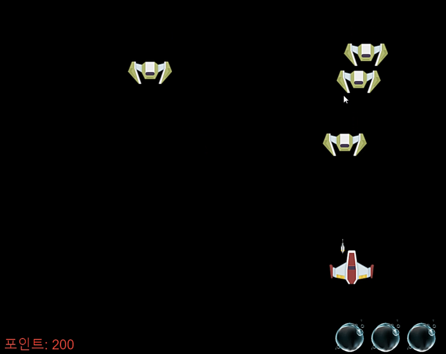

### 게임 설명 🚀

이 게임은 간단한 웹 기반 우주 슈팅 게임입니다. 플레이어는 우주선 영웅을 조종하여 적을 피하고, 레이저를 발사하여 적을 격추해야 합니다. 게임은 영웅의 생명이 모두 소진되거나, 특정 점수 이상을 달성하면 종료됩니다.

### 주요 기능 및 특징 🎮

1. **플레이어 조작**: 화살표 키로 영웅을 이동시키고 스페이스 바로 레이저를 발사할 수 있습니다.
2. **적 등장**: 일정 시간 간격으로 적이 화면 상단의 랜덤한 위치에서 나타나 랜덤한 속도를 가지고 아래쪽으로 이동합니다.
3. **충돌 감지**: 영웅의 레이저와 적, 그리고 영웅과 적 간의 충돌을 감지하고 처리합니다.
4. **게임 종료 조건**: 영웅의 생명이 모두 소진되면 패배로, 일정 점수 이상을 달성하면 승리로 게임이 종료됩니다.
5. **효과음**: 적이 죽을 때 폭발 효과음이 재생됩니다.
6. **게임 리셋**: 게임 종료 시에는 승리 또는 패배에 따라 메시지가 표시되고, Enter 키를 누르면 새로운 게임이 시작됩니다.

### 커스터마이징 💫

1. **게임 승리 조건 변경**
    
    게임에서 일정 포인트(3000점)를 달성하면 승리로 종료되도록 변경하였습니다.
    
2. **적의 랜덤 생성**
    
    적이 랜덤한 x 좌표에서 생성되고, 랜덤한 속도를 갖도록 변경하였습니다.
    
3. **효과음 추가**
    
    적이 레이저를 맞고 죽을 때 폭발 효과음이 재생되도록 하였습니다.
    
4. **게임 종료 메시지**
    
    게임에서 승리 또는 패배 시에 적절한 메시지를 표시하고, 엔터키를 통해 게임을 재시작할 수 있도록 하였습니다.
    
5. **생명 이미지 변경**
    
    산소를 나타내는 이미지를 사용하여 영웅의 남은 생명을 나타내었습니다.

